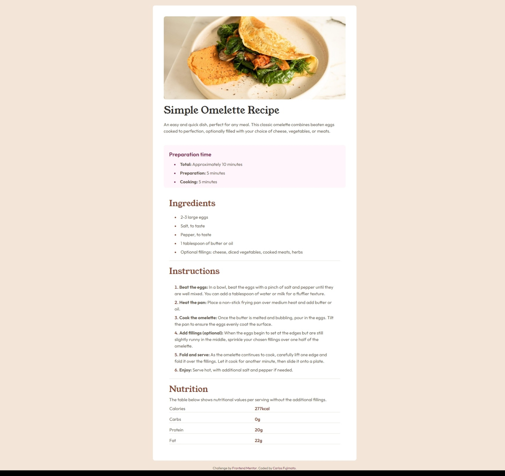

# Frontend Mentor - Recipe page solution

This is a solution to the [Recipe page challenge on Frontend Mentor](https://www.frontendmentor.io/challenges/recipe-page-KiTsR8QQKm). Frontend Mentor challenges help you improve your coding skills by building realistic projects.

## Table of contents

- [Overview](#overview)
  - [Screenshot](#screenshot)
  - [Links](#links)
- [My process](#my-process)
  - [Built with](#built-with)
  - [Continued development](#continued-development)
  - [Useful resources](#useful-resources)
- [Author](#author)
- [Social](#Social)

## Overview

### Screenshot

### Links

- Solution URL: [https://www.frontendmentor.io/challenges/recipe-page-KiTsR8QQKm/hub?share=true](https://www.frontendmentor.io/challenges/recipe-page-KiTsR8QQKm/hub?share=true)
- Live Site URL: [https://carlosfujimoto.github.io/frontend-mentor-recipe-page/](https://carlosfujimoto.github.io/frontend-mentor-recipe-page/)

## My process

### Built with

### Continued development

I'm creating a project from scratch called "timeline", and I need to migrate the html and css structure to something more responsive, like tailwind. This project helped me to train

### Useful resources

- [Tailwind Documentation](https://tailwindcss.com/docs/utility-first) - Tailwind documentation was the most important resource during the project

## Author

- Frontend Mentor - [@CarlosFujimoto](https://www.frontendmentor.io/profile/CarlosFujimoto)

## Social

